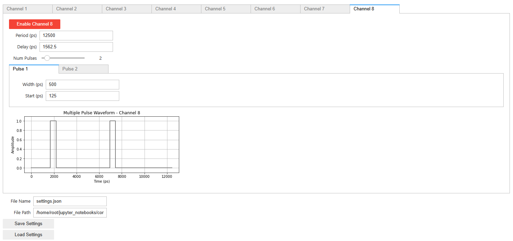

# zPulse

**zPulse** is a Pynq-based pulse generator for the ZCU102 platform. Can in principle be expanded to any Zynq Ultrascale+ board with transceivers available. The design itself is not complex or complicated, but I've found very little references on using transceivers combined with Pynq online.

**DISCLAIMER**: For this design I was using a file called DACRAMstreamer.v. That file is a modified version from one that can be found on the [RFSoC 4x2 MTS example](https://github.com/Xilinx/RFSoC-MTS). Nevertheless, it's not an extremely complex code, but didn't want to waste time making my own.

**DISCLAIMER UPDATE**: I did create my own, and is now within Sources/BRAM_streamer_data.vhd

# Features

This design allows you to create pulses using the Zynq Ultrascale+ Transceiver channels, allowing you to add an arbitrary amount of pulses (>1024) that can be as small as 62.5 ps wide. The system works for up to 8 channels and can store waveforms up to ~130 μs. This number can be easily increased by just reducing the number of channels, and further increased by adding some compresion algorithm.

The waveform for each channel can be configured independently, including period and number of pulses, allowing precise alignment control even after different-length cables at the output. The delays and width you can set are very precise and reproduceable, which is a key requirement for some applications (like my own).

Moreover, when modifying any of the waveforms, the system does not power-off and then on, allowing the signals to maintain phase-locking with any detection device at the output, yet another key requirement for some applications.

Finally, it allows you to save and load settings for all channels, since at re-compilation of the GUI all settings are lost (_oops_).

# Installation

Installing this is a fairly lengthy process, mainly because it changes from board to board, but the steps are all there, just difficult to find all together.

First start cloning the repository with

```bash
git clone --recurse-submodules https://github.com/bmatiasruben/zPulse.git
```

for Git 2.13 or later, or with

```bash
git clone --recursive https://github.com/bmatiasruben/zPulse.git
```

for Git 1.65 or later. This will download the entire repository including the Hog submodule.

## Vivado side

To clone the Vivado project, I am currently using [HOG](https://github.com/Hog-CERN/Hog) to do version control, so follow their instructions to re-create the project. To do so, open a bash console and run

```bash
cd zPulse
./Hog/Do CREATE zPulse
```

which will re-create the Vivado project inside `zPulse/Projects/zPulse`.

The version used was Vivado 2024.2. Even though the board used was the ZCU102, all blocks are present in most Zynq Ultrascale+ chips, just check that the board to use has the transceiver ports available. When trying to do this for a separate board, I recommend doing so for the ZCU102 board and then copying the structure for your own system.

<p align="center">


</p>

When re-generating the project you might see that the input clock frequency for the Transceiver Wizard is 148.5 MHz instead of the standard 156.25 MHz. That is because ZCU102 requires Ubuntu for Pynq to work, and installing Ubuntu changes the frequency of the Si570 to that 148.5 MHz. If using a different board, check if the frequency is correct.

Once the project is re-generated (and re-compiled), you require two files from here that are the bitstream (.bit) and the hardware handoff (.hwh). Those files are located in

```bash
.bit <- $REPO_DIR/Projects/zPulse/zPulse.runs/impl_1/Top.bit
.hwh <- $REPO_DIR/Projects/zPulse/zPulse.gen/sources_1/bd/zcu102_zpulse/hw_handoff/zcu102_zpulse.hwh
```
Alternatively, if you set up the Hog repo correctly and you didn't mess it up too much, you should be able to find the bitstream file also within 

```bash
.bit <- $REPO_DIR/bin/zPulse-vX.X.X-HASH
```

Where X.X.X is the tag you are working on and HASH is the commit hash from git.

## Pynq side

If using a board already compatible with Pynq, then you can skip the next subsection and go directly with a standard Pynq installation or pre-built image.

### Ubuntu installation

If your board is compatible with installing Pynq with Ubuntu on the back side (ZCU102, Kria KV260 and Kria KR260), you need to install Ubuntu first before doing anything. When doing so, I followed the tutorial within [ATchelet/ZCU102-PYNQ](https://github.com/ATchelet/ZCU102-PYNQ). Even though some text is incorrect and still talks about the Kria KV260, the content is correct.

Make sure to install [Ubuntu version 20.04](https://ubuntu.com/download/amd). I tried installing version 22.04 but I didn't manage to make it work, so I stopped testing (it might be compatible with some fix, but I'm not an expert in Ubuntu to try to fix it).

Once Ubuntu is installed, follow up by 
```bash
git clone https://github.com/ATchelet/ZCU102-PYNQ.git
cd ZCU102-PYNQ/
sudo bash install.sh
```

To define a custom IP for your system (highly recommended), you have to edit the file ```bash etc/netplan/01-netcfg.yaml``` so its contents are
```bash 
network:
  version: 2
  renderer: networkd
  ethernets:
    eth0:
      dhcp4: no
      addresses:
        - 192.168.XX.YYY/24
      gateway4: 192.168.XX.ZZZ
      nameservers:
          addresses: [8.8.8.8, 4.4.4.4]
```
Where ZZZ is the gateway you are using on the network. The relevant part is that both the XX parts for the address and the gateway are equal.

# Use

Once the Vivado project is recreated and the bitstream is generated, you will have the two files required for the Pynq Overlay (.hwh and .bit). To enter the Pynq GUI, just type 192.168.XX.YYY:9090/lab (where 192.168.XX.YYY is the IP you set chose on the ```etc/netplan/01-netcfg.yaml``` file). The password to enter the GUI will be xilinx.

Within the Pynq folder, you will find the file zPulse_overlay.py which is a custom class to make control of the pulse generation with transceivers easier, zPulse_GUI.ipynb that is the full GUI for controlling all channels.

I suggest creating the following folder structure within the root directory available in the Pynq environment (corresponding to ```/home/root/jupyter_notebooks```)
```bash
$PYNQ_ROOT_DIR
    ├── zPulse
    │   ├── Bitstream
    │   │   ├── zcu102_zpulse.bit
    │   │   └── zcu102_zpulse.hwh
    │   └── zPulse_overlay.py
    └── zPulse_GUI.ipynb
```
and then modify the line creating the overlay on the jupyter notebook to be compliant with either this or your own folder structure. By default, the line is compatible with the one provided here, such that
```bash
ol = zPulseOverlay("zPulse/Bitstream/zcu102_zpulse.bit")
```

To start the zPulse GUI, just run the only cell present in zPulse_GUI.ipynb. From within the GUI, you can control everything you need, from pulse width, pulse offset, number of pulses, and overall waveform period.

<p align="center">

</p>

# Contribute

If you regenerate this design for a different FPGA board that is not the ZCU102, please let me know and it can be added within this same repository. Hog allows you to control separate projects (aimed for different boards for example), so it is easy to integrate new board designs.

Any bug or problem that you find please report it as an issue.
